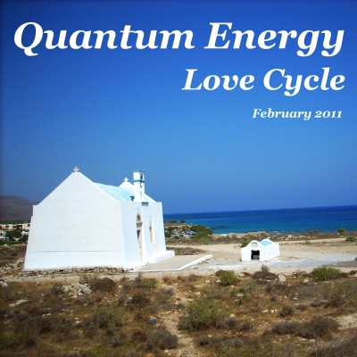

# Love Cycle (February 2011)

----

Date: 2011-02-13    
Tags: dnb, neuro funk, liquid dnb    

----

----

Love Cycle is a special chapter of the Quantum Energy series, recorded in February 2011 — just before Valentine’s Day and shortly after a beautiful New Year’s Eve spent in Cracow, followed by a snowy snowboard escape with family and friends to Białka Tatrzańska.

This set reflects that moment in time: full of love, warmth, motion and connection. It’s a personal time capsule capturing post-holiday emotions and pre-Valentine anticipation, translated into bass, melody and rhythm.

Expect a dynamic journey through drum and bass, blending liquid, neurofunk and energetic vibes — from emotional atmospheres to powerful drops and raw energy.

**Listen on**:

* [**YOUTUBE**](https://youtu.be/iM6WP0YmFNQ) 
* [**MIXCLOUD**](https://www.mixcloud.com/quantumenergy/love-cycle-february-2011/) 

**TRACKLIST**  

* tyler straub – trusted judgement (original mix)
* jenna g – in love (original mix)
* friction, tasha baxter – life cycle (original mix)
* darren tate ft. czech national symphony – dark skies (original mix)
* rawskus, sidius – alive (original mix)
* xilent – step one (original mix)
* xilent – crystalia (original mix)
* xilent – blossom (original mix)
* sub focus – rock it (original mix)
* camo & krooked – shoreless (original mix)
* camo & krooked – nothing is older than yesterday (original mix)
* dynamite mc, camo, fraction, krooked – stand up (original mix)
* scrillex – scary monsters & nice sprites (original mix)
* calvertron, tim healey ft. sirreal- rock it roll it (pippa trix dirtyloud remix)
* bassbin twins – skroo (original mix)

All tracks are available to buy on <a href="http://beatport.com" target="_blank">Beatport</a>.  
You can listen them on <a href="https://open.spotify.com/playlist/41aDriNFS6jYpioCR6cTe5?si=lIajGYZ2SzO4K3TCIna5IQ" target="_blank">Spotify</a> as well.  
Enjoy!

----

[BACK TO MAIN PAGE](./README.md)

----